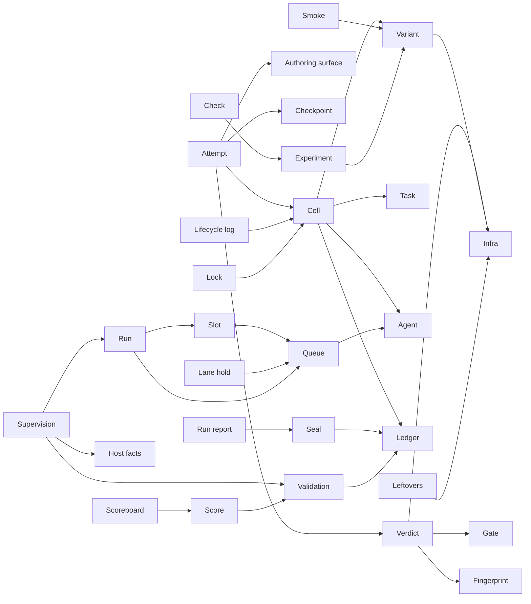

# FAE concepts

A concept is a unit of function the operator meets: it has a name, one
purpose, a state of its own, actions, and an operational principle (the
typical scenario that shows the purpose being met). Concepts are independent
and work together through the objects that implement them. It follows
[concept design](https://essenceofsoftware.com): each concept is checked
against six qualities (user-facing, functional, behavioural, independent,
purposive, reusable) and carries aliases and a cluster, as in
[concept-centric development](https://arxiv.org/abs/2304.14975).

Read the map first, then the entry of a concept you need. Aliases are the
other names a reader may know, or that the code or older text uses; the
canonical name is the first column. Concepts that act in ways the operator
would not expect, and names that collide, are in
[`TODO-concepts.md`](TODO-concepts.md).

## 1. The map

| Concept | Description | Aliases | Objects | Concerns |
|---|---|---|---|---|
| **The experiment** | | | | |
| Experiment | One root's definition and workspace, and the actions on them as a whole | root | `Experiment`, `Definition` (`fae/experiment/`) | what is compared; run-wide actions |
| Variant | One complete set of what the agent is given and how its work is judged | treatment, arm, condition | `Variant`, `variants/files.py` | comparability; one source per input |
| Task | The skeleton every variant starts from, and its prompt | — | `Definition`, `prepare.py` | the problem held constant |
| Agent | A tag naming a client, a model and an effort | model, lane (its queue) | `agents.toml`, `load_agents`, `AgentImage` | who authors |
| Gate | The arrangements one attempt must all pass | shape gate | `Gate`, `cell/contrib/` (external) | what green means, structurally |
| Fingerprint | The hash of everything a verdict depends on | verify surface | `Cell.fingerprint`, `Cell.expected_fp` | provenance |
| **The cell** | | | | |
| Cell | One agent, variant, task and rep, run to a verdict in its own folder | workspace (its folder) | `Cell` (`fae/cell/`) | the unit of measurement |
| Attempt | One author–restore–judge round within the budget | iteration (`ITER`) | `Cell`, `ledger.py`, `verify.py` | the primary measure |
| Authoring surface | What the agent may write; everything else is restored before judging | authorable surface, skeleton manifest | `Surface` | a fair judged tree |
| Checkpoint | The tree of every attempt, kept beside the agent's own repo | — | `Checkpoints` | provenance; clean retries |
| Verdict | The outcome of one arrangement: pass or fail, the stage, charged or refunded | void, refund, uncharged | `Verdict`, `VerifyResult` | rig faults vs authoring failures |
| Ledger | The cell's append-only file of record | iterations.log | `ledger.py` via `Cell` | one truth; one parser |
| Seal | Marks a finished cell's result immutable | — | `Cell` (sealing) | evidence that cannot drift |
| Infra | What exists around a variant's program, kept by its cell, set up for the cell and per arrangement | substrate | `Infra`, `DefaultInfra`, `secrunner`, `dind`, `kind` | provisioning; isolation |
| **The run** | | | | |
| Queue | The specs waiting, running and done, one lane per agent | backlog, lane | `Queues` | what runs next; fairness |
| Slot | A held place under a cap: work slots, and each variant lock's slots | arm slot, cap | `Queues`, `mutex` | concurrency bounds |
| Lane hold | A lane that admits nothing: parked, cooling, or on budget hold | park, cooldown, budget hold | `Queues`, `supervise` | provider walls; operator control |
| Run | The scheduler and supervisor: admits specs, starts cells, repairs them | conduct, orchestrator, scheduler | `Conduct` (`fae/conduct/`) | liveness; admission |
| Supervision | Judges each cell by its process and output, and repairs or hands it back | reconcile, diagnose, repair | `supervise`, `host` | recovery without a second controller |
| Lock | A kernel `flock` on a file, released when its holder dies | rig lock (the exclusive one) | `mutex`, `Cell` | mutual exclusion; crash safety |
| Leftovers | Containers, clusters and loops no live cell owns | zombies | `zombies` | a clean host |
| Lifecycle log | Every cell's transitions, replayable against the formal model | transitions.log, live trace | `Cell`, `tla_verify`, `Experiment.reset_trace` | conformance |
| Host facts | What the host shows: loops, containers, memory, sleeps | host-sleep book | `fae/host.py` | honest ages; status |
| **The results** | | | | |
| Validation | Whether a finished cell's verdict can be believed: VALID or TAINTED | taint, trust check | `experiment/scoring/validate.py`, `Experiment.validate_cell` | separating rig faults from data |
| Score | One finished cell's record: attempts to green, authored surface, timings | score.json | `score_cell.py`, `Experiment.score` | the per-cell datum |
| Scoreboard | The table over all scored cells, by variant and by factor | aggregate, results | `aggregate.py`, `Experiment.aggregate` | comparison |
| **Readiness** | | | | |
| Check | Whether this root's experiment is ready to run | — | `Experiment.check`, `check_exp.py` | catching faults before cells |
| Smoke | Each variant's reference answer run through the whole pipeline with no agent | reference, `ref` | `Experiment.smoke` | the rig judges a known answer green |

## 2. The concepts

### The experiment

1. **Experiment.** Purpose: one place to act on what this root compares.
   State: the definition (loaded once per process) and a workspace.
   Actions: prepare, check, smoke, validate, score, aggregate.
   Principle: the operator runs a verb on the experiment and it acts on its
   own workspace unless another is named.
2. **Variant.** Purpose: make two compared conditions differ exactly where
   their files differ. State: `<experiment>/variants/<id>.toml` (template,
   surface, inputs, tools, access, verify run, infra, factors, retired).
   Actions: read; retire. Principle: adding a variant is adding a file;
   results group by variant and by each factor it declares.
3. **Task.** Purpose: hold the problem constant across variants. State: the
   skeleton and the prompt. Principle: every variant's template starts from
   the same task, versioned with the verifier.
4. **Agent.** Purpose: name who authors. State: a tag in `agents.toml`
   mapped to a client, a model and an effort. Principle: the tag is part of
   every cell id, so each agent's cells and queue are its own.
5. **Gate.** Purpose: define green as passing every arrangement. State: the
   arrangements and whether the first rotates with the attempt. Principle:
   an attempt is green only when all arrangements pass.
6. **Fingerprint.** Purpose: tie each verdict to exactly what judged it.
   State: a hash over the experiment tree, the declared fingerprint trees
   and the engine's `fae/cell/` and `fae/experiment/`. Actions: pin at the
   cell process's start; compare at every verify. Principle: a change in
   between refunds that verify (stage `harness-fp`).

### The cell

1. **Cell.** Purpose: one measurement. State: its folder, its env, ledger,
   seal and checkpoints. Actions: prepare, run, pause, resume, stop,
   reverify. Principle: the cell runs attempts until a verdict ends it
   green, failed or revoked. A wiped folder retires the id (a `Retire`
   record), so a reused id names a new cell.
2. **Attempt.** Purpose: count the tries to green. State: `START` and `ITER`
   lines in the ledger. Actions: author, restore, judge. Principle: only a
   charged verdict consumes an attempt; a refunded one is retried with the
   agent's edits discarded.
3. **Authoring surface.** Purpose: judge only what the agent was allowed to
   write. State: the seed manifest beside `artifacts/`, outside the agent's
   mount. Actions: heal, evict, check before every verdict. Principle: a
   changed seeded file is restored and an out-of-surface file is moved out.
4. **Checkpoint.** Purpose: keep what each attempt authored. State: git
   trees in `.attempts.git`, beside the agent's work tree. Principle: a
   retry restarts from the last charged tree.
5. **Verdict.** Purpose: separate authoring failures from rig faults.
   State: ok, stage, why, charge, stand-down, metrics, files. Principle: a
   rig fault is uncharged, refunded and retried; a stand-down pauses the
   cell for the operator.
6. **Ledger.** Purpose: one record of what happened, read one way. State:
   `iterations.log`, appended only. Principle: every view of a cell's
   outcome is derived from it by one parser.
7. **Seal.** Purpose: keep finished evidence from changing. State:
   `.sealed`. Principle: the result is immutable; derived files
   (validation, score) are regenerated; new evidence goes under
   `reverify/<ts>/`.
8. **Infra.** Purpose: provide the world a variant's program runs in.
   State: the infra class and the variant's parameters; one instance per
   cell, kept by the cell. Actions: cell setup and teardown, verify setup
   and teardown, ok, alive. Principle: a variant names its class; the
   verifier reaches the infra only through it.

### The run

1. **Queue.** Purpose: decide what runs next. State: one spec file per cell
   in `queue/`, `running/`, `done/`, one lane per agent. Actions: enqueue,
   claim, release, finish, shelve, cancel. Principle: a spec moves between
   directories by atomic renames, so a crash leaves it in exactly one place.
2. **Slot.** Purpose: bound how many cells, and how many of one infra kind,
   run at once. State: `work-slots/` and `arm-<lock>.slots/` files held by
   `flock`. Principle: the run takes a cell's slots and hands their
   descriptors to the cell process, which holds them for its life.
3. **Lane hold.** Purpose: stop a lane admitting while it cannot or should
   not run. State: a parked queue directory, a cooldown until a provider's
   reset, a budget hold near the weekly cap. Principle: a held lane keeps
   its specs and admits again when the hold ends.
4. **Run.** Purpose: turn the queue into running cells, and only that.
   State: `.conduct/` (its pid, the reconcile log, the respawn book).
   Actions: run, pause, resume, stop, diagnose, repair. Principle: one run
   admits round-robin across lanes, starved first, under the caps, and
   supervises every pass.
5. **Supervision.** Purpose: repair by mechanism, never by guess. State:
   what it has already reported. Actions: respawn a crashed cell, validate
   a finished one, alert. Principle: each pass reads process, output and
   ledger, then repairs, requeues or hands the cell to the operator.
6. **Lock.** Purpose: mutual exclusion that survives any crash. State: a
   file and the holder's open descriptor. Principle: the verify lock lets
   one verify run on the host at a time; the kernel releases a lock when
   its holder dies, so nothing is ever judged stale.
7. **Leftovers.** Purpose: free the host of what dead cells left. State:
   none; names come from the infra classes and verifiers. Actions: find,
   reap. Principle: anything whose owner is a live cell is never touched.
8. **Lifecycle log.** Purpose: check the run against its formal model.
   State: `transitions.log`, appended only. Actions: append, reset (an
   `EPOCH` block), replay. Principle: `experiment check --tla-trace`
   replays the log from its last `EPOCH` block against `.tla/Runs.tla`.
9. **Host facts.** Purpose: tell status what the host knows. State: the
   host-sleep book. Principle: ages exclude the time the host slept.

### The results

1. **Validation.** Purpose: believe a verdict only on its evidence. State:
   `validation.json`. Principle: supervision validates every finished cell
   once; the engine's rules and the experiment's taint rules decide VALID
   or TAINTED, and a taint is raised to the operator, never requeued.
2. **Score.** Purpose: one comparable record per finished cell. State:
   `score.json`. Principle: `results score` validates, then scores each
   finished cell of the workspace.
3. **Scoreboard.** Purpose: compare variants. State: `results.csv`,
   `results.json`. Principle: built from the scored cells; a record older
   than its inputs refuses the table.
4. **Run report.** Purpose: show what was produced since a moment. State:
   none. Principle: cells sealed since the run's start (or a given
   moment), grouped by variant, and the cells still working.

### Readiness

1. **Check.** Purpose: find what would fail before cells run. Actions:
   prerequisites, configuration, definition, variants, seeds, infra,
   engine invariants, leftovers, trace, pipeline. Principle: each step
   reports its findings; the summary names the HOWTO sections that fix
   the failed ones.
2. **Smoke.** Purpose: show the rig judges a known answer green. State:
   cells in `ws-smoke.nosync`, agent `ref`. Principle: each variant's
   reference runs the whole pipeline with no agent and must be green.

## 3. Dependencies

An edge A → B means A needs B to make sense.

## 4. Experiment concepts

The words an experiment is described in. A cell id spells most of them:
`<agent>_<effort>_<variant>_<task>_r<rep>`.

1. **Variant.** One complete set of what the agent is given and how its work
   is judged. The A/B-testing word, because more readers know it; *treatment*
   (experimental design), *arm* (clinical trials) and *condition*
   (psychology) say the same to fewer people.
2. **Factor.** What a variant is a level of (for example the technology, or
   the docs given), as data in its file. The design-of-experiments word,
   kept because the results group by it and no plainer word says "a
   dimension the variants differ along".
3. **Task.** The problem: a skeleton and a prompt. The plain word for what
   the agent is asked to do.
4. **Agent.** The tag that names a client, a model and an effort. "Agent"
   rather than "model", because the same model behind another client or
   effort is a different subject.
5. **Effort.** The reasoning effort the agent runs at, part of the cell id.
   The clients' own word.
6. **Rep.** One repetition of the same agent, variant and task (`r<n>`).
   Short for repetition, the word for re-running a measurement.
7. **Cell.** One agent × variant × task × rep, the unit measured. The
   design-matrix word: each combination fills one cell of the matrix.
8. **Attempt.** One author–restore–judge round, within the attempt budget.
   "Attempt" because it is what the agent does; the ledger writes `ITER`.
9. **Gate.** The arrangements an attempt must all pass to be green. A gate
   lets through only what passes every check.
10. **Arrangement.** One configuration an attempt is judged under (for
    example an ordering of load events). The neutral word for "the same
    test, set up differently".
11. **Verdict.** What one judged attempt came to: pass or fail, the stage,
    charged or refunded. The word for a judgement that settles a case.
12. **Charged / refunded.** Whether a failed verdict consumes an attempt.
    Budget words: an authoring failure is charged; a rig fault is refunded.
13. **Taint.** A reason not to trust a finished cell's verdict; the cell is
    TAINTED rather than VALID. "Tainted evidence" is evidence that cannot
    be relied on.
14. **Seal.** The mark that makes a finished cell's result immutable, as a
    sealed record cannot be altered.
15. **Smoke.** The no-agent run of every variant's known answer through the
    whole pipeline. From smoke testing: the first test that shows nothing
    is on fire.
16. **Reference.** A variant's known-good answer, the one smoke runs. The
    answer the others are judged against.
17. **Lane.** One agent's queue. Like a lane on a road: its cells go in
    order and do not overtake each other.

## 5. Resources (data)

Where the objects keep their data, and the external systems they drive. A
resource has one owner; code that is not its owner and reaches it directly
(a path joined to its name, a glob, the system's own command) goes around
the owner. "Reached by" lists the code patterns (regexes) that reach it.

| Resource | Kind | Owner | Reached by |
|---|---|---|---|
| `<workspaces>/<cid>/` | folder | `Cell` | `/ "cell\.env"`, `/ "iterations\.log"`, `/ "\.sealed"`, `/ "\.paused"`, `/ "\.cancelled"`, `/ "\.loop"`, `/ "metrics\.json"`, `/ "verify\.log"`, `/ "deploy\.log"`, `/ "resources\.json"`, `/ "PROMPT\.md"`, `/ "artifacts"`, `/ "arrangements"`, `/ "\.verify-out"`, `"agent\.attempt-`, `glob\("\*/` |
| `transitions.log` | file | `Cell` | `plane\.transitions_log\(`, `plane\.TRANSITIONS\b` |
| `.queues/` | folder | `Queues` | `/ "queue"`, `/ "running"`, `/ "done"`, `/ "requests"`, `work-slots`, `weekly\.json`, `agent-io\.json`, `\.parked"` |
| `.locks/` (a cell's locks) | folder | `Cell` | `"loop-locks"`, `/ "verify-lock"`, `/ "rig-lock"` |
| `.locks/queues-lock` | file | `Queues` | `"queues-lock"` |
| `.images/` | folder | `AgentImage` | `plane\.images\(`, `agent_image\.json`, `"image-lock"` |
| `.conduct/` | folder | `Conduct` | `plane\.conduct\(`, `conduct\.pid`, `reconcile\.log` |
| `results.csv`, `results.json` | file | `Experiment` | `OUT_CSV`, `OUT_JSON`, `/ "results\.csv"`, `/ "results\.json"` |
| Docker (containers, networks, images) | external | — | `\["docker"`, `"docker",` |

